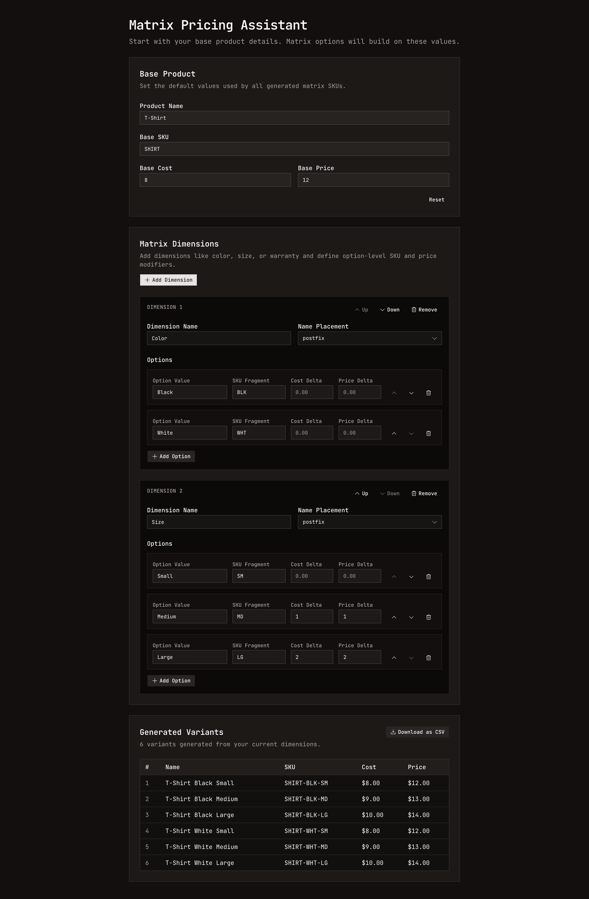

# Matrix Pricing Assistant

Matrix Pricing Assistant is a client-side tool for building product variants and pricing matrices for eCommerce listings.  

Define a base product once, add dimension rules (like color, size, or warranty), and instantly generate every SKU combination with calculated cost and price.



## Features

- Configure your base product with a SKU, cost, and price.
- Matrix dimensions with option-level configuration:
  - Option value
  - SKU fragment
  - Cost modifier
  - Price modifier
- Per-dimension name placement control (`prefix` or `postfix`) to shape final variant names.
- Real-time variant generation with final:
  - Product name
  - SKU
  - Cost
  - Price
- Reordering support for both dimensions and options.
- CSV export for generated variants (filename uses the base SKU).
- Local persistence via local storage so your work is retained between sessions.


## Tech Stack

- Next.js
- React
- Tailwind CSS + Shadcn UI
- Jotai
- PapaParse

## Development

```bash
pnpm install
pnpm dev
```
